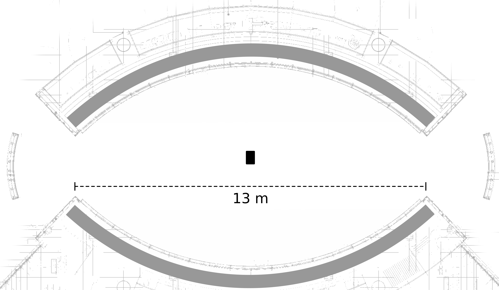
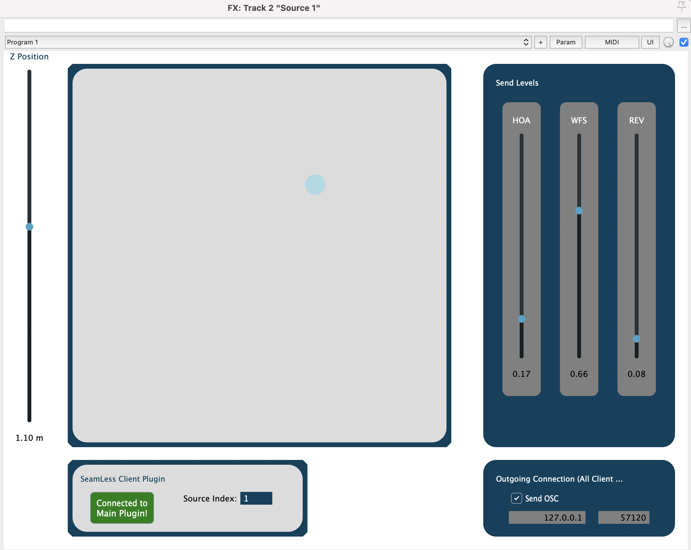
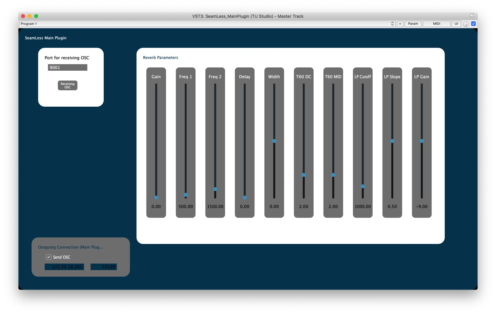

# About the System

## Concept


The Ethnomusicology Museum at the newly built
[Humboldt Forum](https://www.humboldtforum.org/en/) features a listening room for immersive
illustration of relevant auditory content.
It is unique in that it combines multiple methods for sound field synthesis,
mainly Wave Field Synthesis (WFS) and Higher Order Ambisonics (HOA), thus
providing an enhanced spatial experience.
A dedicated software system, developed by the [Audiocommunication Group](https://www.ak.tu-berlin.de/menue/fachgebiet_audiokommunikation/)
at TU Berlin, allows a seamless integration of these methods.


## Loudspeaker Configuration

The listening room features 32 WFS panels by [Four Audio](http://fouraudio.com/en/products/wfs.html). This results in a total of 256 WFS channels, using 768 tweeters and 64 woofers.  Both arcs hold 16 panels each, mounted as a continuous ribbon above head height with  a  horizontal  speaker  distance  of 10 cm.   45 Genelec 8020C speakers are arranged  in  three  levels  on  each  arc,   used  for Ambisonics rendering.

{: style="width:500px"}

*Top view of the listening room with the entrances (left,right) and two
arcs, each with a ribbon of WFS panels (gray).*

---

{: style="width:600px"}

*Side view of a single arc with the ribbon of WFS panels (gray) and the Ambisonics speakers (black).*

---

## Fundamentals of Spatialization

### The Virtual Sound Source

The combined system works with so called *virtual sound sources*, also referred
to as the object oriented approach of sound spatialization.
The figure below shows the model of such a virtual sound source,
which is defined by its position, using two angles, the distance and a source width.

{: style="width:400px"}

Every sound event in a project or composition can be connected to such a virtual sound source,
allowing to place it in the listening space.
Depending on the preferred workflow, different tools can be used for a dynamic
arrangement of the individual sound sources.
The provided tools in [Reaper](reaper/) grant a quick entry
by providing control through simple automation trajectories in a DAW project.

### The Send-System

In addition to the position of the virtual sound source,
the proposed approach also allows the continuous fade of
sound events between the Ambisonics and the WFS rendering
through a send system.

Depending on the used rendering-module in the HuFo-System (WFS, Ambisonics, Reverb) additional attributes can be defined, e.g. *plane wave* and *Doppler effect* for the WFS module.
The rendering modules are running parallel for all sources. Which rendering module is used can be determined with additional "send to" parameters, which control the amount of the audio-signal being sent to a specific rendering module. In that way a fades from on to another system as well as mixtures can be realized.

## Implementation within the Listening Room

### Signal Flow

Each audio track in a REAPER project is connected to a virtual sound source and is directly routed to the system with DANTE and then rendered.
For defining an audio-source in REAPER a Plugin is used for sending the source attributes via OSC synchronized to the audio playback. Here the *SeamLess Main Plugin* and the *SeamLess Client Plugin* by TU Studio is used.

{: style="width:500px"}

### SeamLess Plugins

The SeamLess Plugins are designed to control
[SeamLess](https://github.com/anwaldt/seamless), which combines
multiple methods for spatial sound reproduction.
They are currently being tested as VST3 on both Linux and MAC
systems with REAPER as the standard DAW.

#### Client Plugin

The *SeamLess Client Plugin* allows to place virtual sound sources inside of the room by assigning the x/y/z-position of the source as well as the gain of the WFS, Higher Order Ambisonics and Reverb.
It controls the properties of multiple sound sources and needs to be added to each channel of a DAW project.
It does not process audio.

All instances share the same *Outgoing Connection* properties.
Each *Client Plugin* sends all parameters at a fixed send rate
of 50 Hz, if not disabled.

{: style="width:700px"}


#### Main Plugin

The *SeamLess Main Plugin* controls the OSC-data of the automations remotely. It also sets several reverb parameters to the project.  

{: style="width:900px"}

### OSC Paths

In their current version, the plugins
use the following OSC paths for sending
and receiving messages.


### Spatial

All spatial control messages get two arguments:

- the ID of the source to control (starting at index 1)
- the position (cuurently ranging from -10 to 10 meters).

#### X Position

```console
/source/pos/x i f
```

#### Y Position

```console
/source/pos/y i f
```

#### Z Position

```console
/source/pos/z i f
```

### Bus Send

OSC messages for the send gains of the channels
take three arguments:

- the ID of the source to control (starting at index 1)
- the index of the bus to send to (starting at 0 OR 1)
- the gain (ranging from 0 to 1)

```console
/send/gain i i f
```
