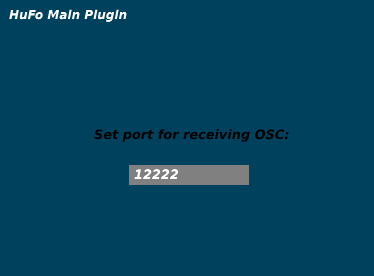

# SeamLess Plugins

The SeamLess Plugins are designed to control
[SeamLess](https://github.com/anwaldt/seamless), which combines
multiple methods for spatial sound reproduction.
They are currently being tested as VST3 on both Linux and MAC
systems with Reaper as the standard DAW.

For automating system parameters from a DAW,
multiple instances of the *Client Plugin* are
needed. For remote OSC control of the automations,
a single instance of the *Main Plugin* is required.

## Client Plugin

For controlling the properties of multiple sound sources,
a *Client Plugin* needs to be added to each channel of a DAW project.
It does not process audio.
The *Source Index* needs to be set for each individual instance.
Indices should not be duplicated.  

All instances share the same *Outgoing Connection* properties.
Each *Client Plugin* sends all parameters at a fixed send rate
of 50 Hz, if not disabled.

{: style="width:700px"}

## Main Plugin

If included, the *Main Plugin* needs to be added to the project before
all *Client Plugins*. It does not process any audio and can be added
to any channel or bus. The only parameter to be set is the port on which
to listen for incoming OSC messages.

{: style="width:200px"}
