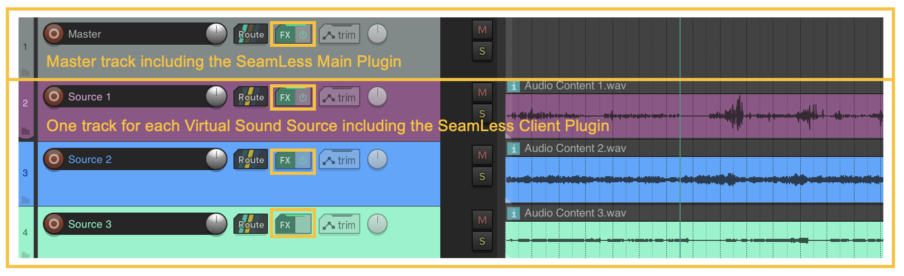
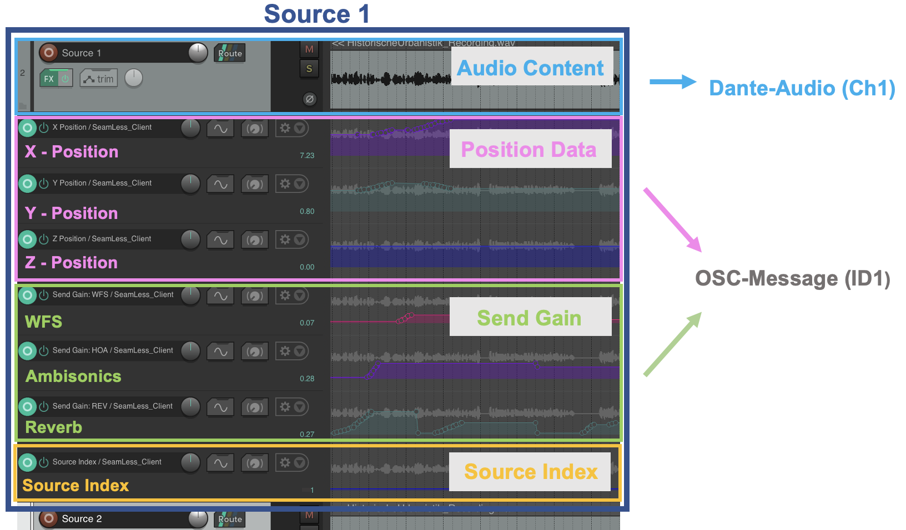
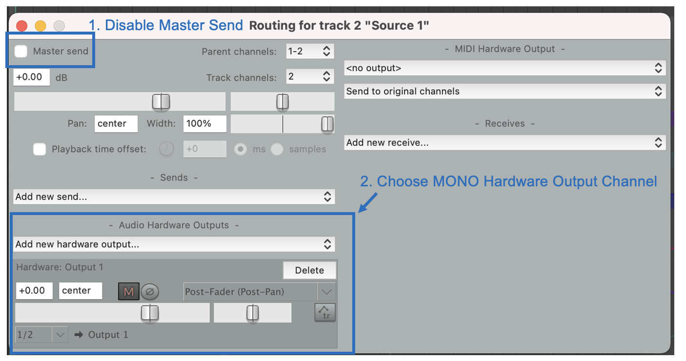
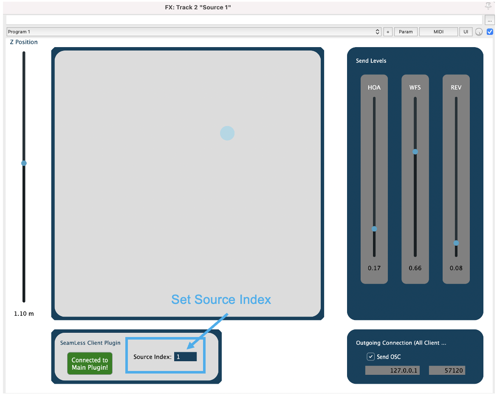
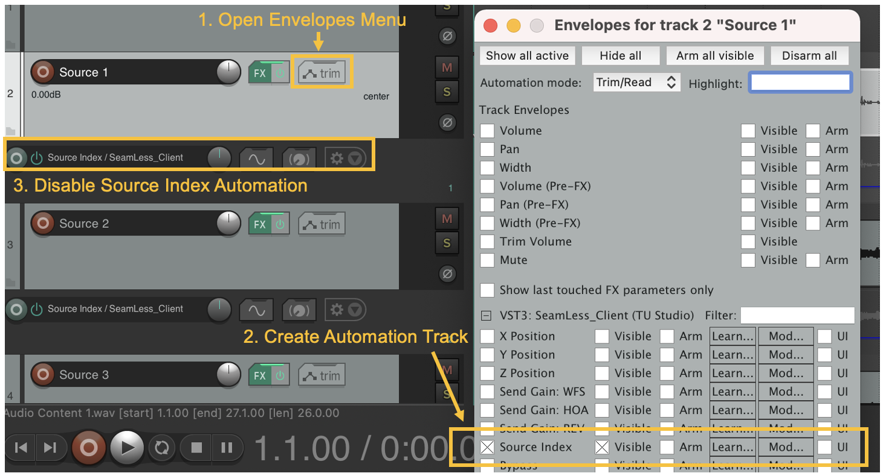
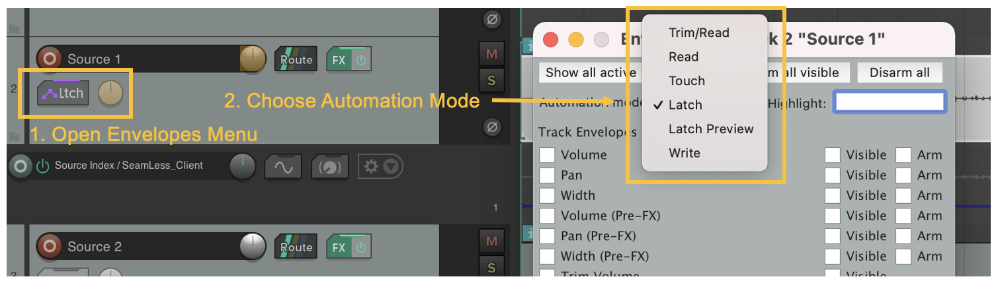
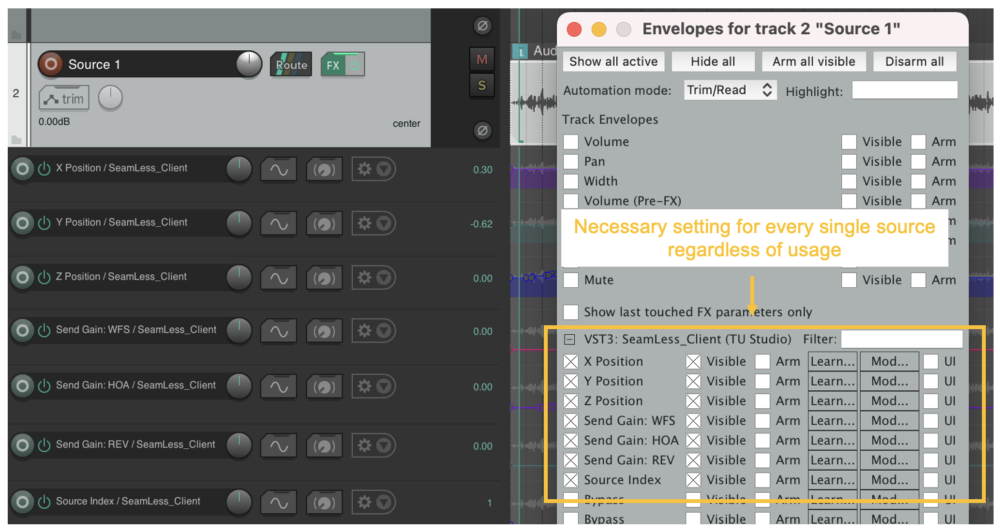

# Using the system

The most accessible way of using the *SeamLess* system is a single DAW session from a laptop, just as working with any other multi-track audio project.
Reaper is used as the standard software in most projects and recommended.
Other solutions are possible but not fully tested.
The following sections explain the process of creating a spacial audio project by describing the setup, routing and use of the *SeamLess Plugins* step by step.  

---

## Content Production Process

Your project will consist of several virtual sound sources which may change their location, used loudspeaker system and reverb over time. 
Therefore when you create your project you need to generate a track for each source with its own audio content and routing. In the Humboldt Forum you are able to use up to 64 virtual sound sources. 

Based on this you are able to control and automate the source position and additional properties as any other parameter using the *SeamLess Plugins*.
This workflow ensures that content can be prepared in advance and ported to the system afterwards. 

---

## Project Setup 

For remote OSC control of the automations of the sources, a single instance of the *Main Plugin* (Download Link: ...) is required. It needs to be added to the project before all *Client Plugins*. It does not process any audio and can be added to any channel or bus. The port on which to listen for incoming OSC messages needs to be set aswell as the intended reverb parameters.

Every further track represents one virtual sound source with its audio content and needs to include the *Seamless Client Plugin* (Download Link: ...). By definition all audio sources are mono-audio sources and best results in spatial precision are achieved by sending all audio-element to a single audio source. Of course stereo or other multichannel material can be used too, by using audio sources as virtual speakers which are rendered by the system.

{: style="width:900px"}

Using the *Seamless Client Plugin* will produce automation data for each source, so they will have the following shape: 

{: style="width:900px"}

## Routing

To integrate the DAW session into the HuFo-system you first need to connect your laptop to the Dante device: Go to preferences &#8594 devices &#8594 select the audio device. 

To route the source tracks disable the master send and select a MONO hardware output channel, either as direct hardware output or if you are using bus-systems to a mono channel on the bus-track.

{: style="width:900px"}

---

## Assigning source parameters

The *SeamLess Client Plugin* is used to assign source properties like the desired x,y,z-positions, the reverb and the gain of the ambisonics system (HOA) and wave field synthesis (WFS). 

The first step is to assign the source index inside the plugin. Do this by opening the corresponding *Client Plugin* and assigning the source index (e.g. 1, 2, 3, ...). Thereby every audio source is identified by an ID (1-64) which corresponds to the channel the audio is sent out. sThose indices should not be duplicated and need to be set for each individual instance.  

{: style="width:900px"}

Then open the envelopes menu and tick the box "Source Index" to create the automation track. **Be careful with Source Index Automation because no other automation points may be written at this track.** To be sure disable this automation track. 

{: style="width:900px"}

Afterwards you can start assigning the source properties by writing automation data either inside the plugin directly or with the pencil tool inside of REAPER. You can also use hardware controllers, which connect to the central OSC router.

To write automation data you need to change the automation mode from Read to Latch,Write or Touch. For further information about the different automation modes see the Reaper User Manual, Chapter 18.6: *Writing Automation*, p. 335)

{: style="width:900px"}

**Important notice: If you change a parameter inside the plugin it will automatically create an envelope for that parameter. It is of importance that there is an envelope for every parameter even if you don't use it! Therefore it might be necessary to add missing envelopes manually.** 

{: style="width:900px"}

---

## Content Playback

The result of a production is a multichannel audio file in which the plugin automation data will be embedded with REAPER's Take FX function. This file including the automations will be saved in Reaper Project Bay and then can be pasted and arranged in a playback project.

For the project-export a Reaperscript is provided which automates the rendering and data-embedding process.
