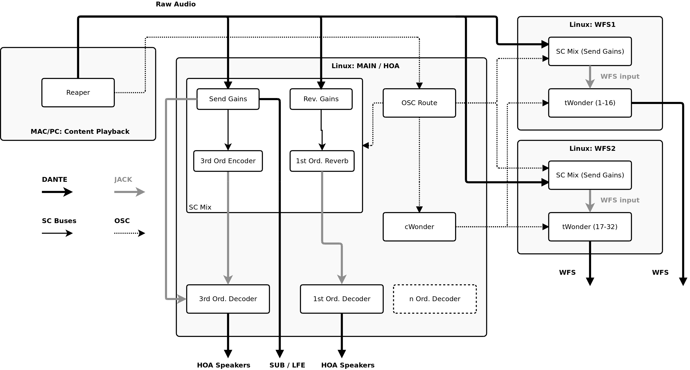

# Signal Flow

The following flow chart visualizes the interconnection between the software components. Scroll down to get the exact input and output assignment.

## Input-Output Assignment

## Linux: MAIN (DANTE)

Inputs  | Source
---     | ---  
1-64    | Source channels from media machine.

Outputs | Target
---     | ---  
1-22    | DAC 1 (Ambisonics speakers 1-22)
23-44   | DAC 2 (Ambisonics speakers 23-44)
45      | DAC 1 (Ambisonics spekaer 45)
46-47   | DAC 1 (SUB 1-2)
48-49   | DAC 2 (SUB 3-4)

----
