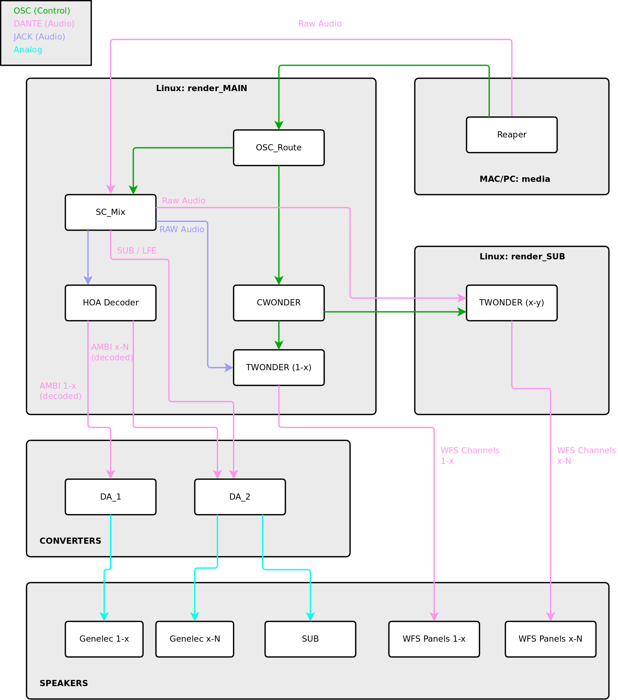

# HuFo_System

## Signal Flow

## Ambisonics Decoders

For larger loudspeaker setups (<24), standalone Jack decoders are used.

## Included in this Repository

### OSC Router

### SuperCollider Mixer and HOA Renderer

## Submodules

### WONDER Lite

### Ambisonics Decoder Toolbox
